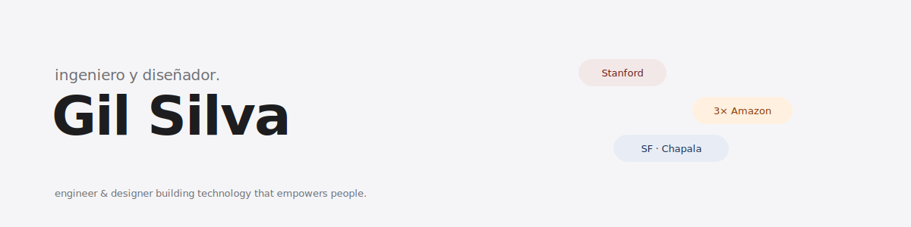

<!--
  ┌─────────────────────────────────────────────┐
  │  Gil Silva · GitHub Profile README           │
  │  github.com/gilxsilva                        │
  └─────────────────────────────────────────────┘
-->

<div align="center">



<p>
  <a href="https://portfolio-one-dun-7bqa00r7vk.vercel.app">portfolio ↗</a>
  &nbsp;·&nbsp;
  <a href="https://www.linkedin.com/in/gilxsilva/">linkedin ↗</a>
  &nbsp;·&nbsp;
  <a href="https://instagram.com/gilxsilva">@gilxsilva</a>
</p>

</div>

### about me

bay area kid. raised in chapala, jalisco. back in the US for stanford

i build at the intersection of **HCI, social impact, and product**

```
currently → SDE intern @ Amazon (summer 2026)
studying  → Symbolic Systems (HCI) @ Stanford
open to   → intern roles, summer 2027
```

### fav repos ✦

| repo                                                                    | what it is                                                                                                              |
| ----------------------------------------------------------------------- | ----------------------------------------------------------------------------------------------------------------------- |
| [**kyro-app**](https://github.com/gilxsilva/kyro-app)                   | emotional scheduling app: plan by energy, not just time. best concept + most novel product, stanford cs147 expo         |
| [**finding-our-voice**](https://github.com/gilxsilva/finding-our-voice) | bilingual website for immigrant youth. co-founded the program with 826 valencia at mission high school, sf. $10k grant. |
| [**portfolio**](https://github.com/gilxsilva/portfolio)                 | my personal site: next.js, typescript, too many commits at 2am                                                          |
| [**gem-cs278**](https://github.com/gilxsilva/gem-cs278)                 | social map for discovering meaningful places through people you trust                                                   |
| [**hackharvard-2025**](https://github.com/gilxsilva/hackharvard-2025)   | chrona: all-in-one academic dashboard, built at hack harvard                                                            |

<div align="center">
<sub>© Gil Silva · <a href="mailto:gscgilbertosilva@gmail.com">gscgilbertosilva@gmail.com</a> · available summer 2027</sub>
</div>
